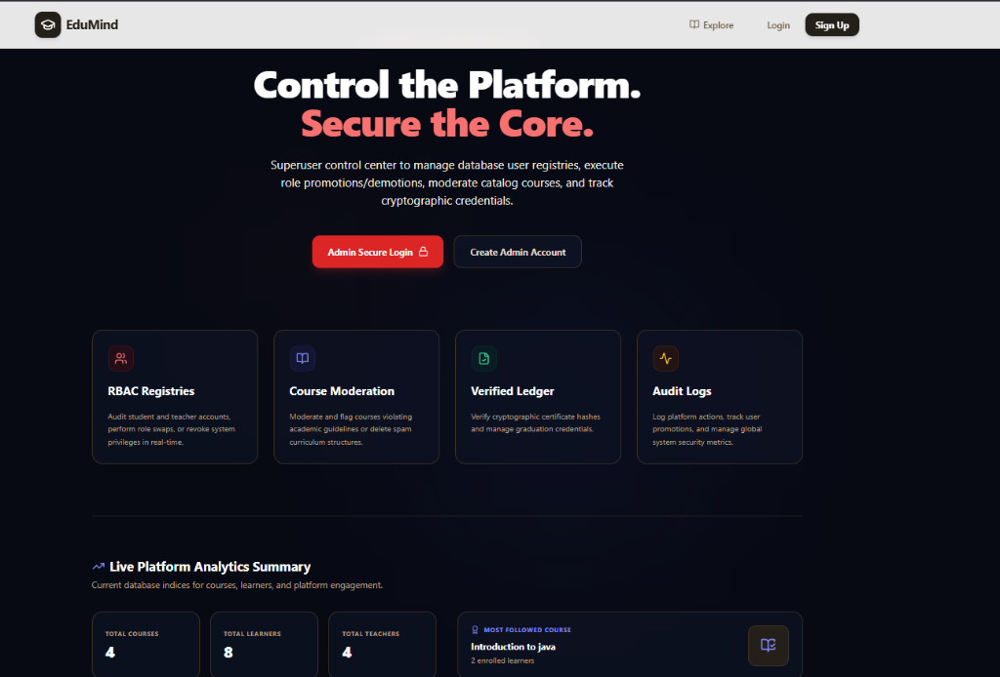
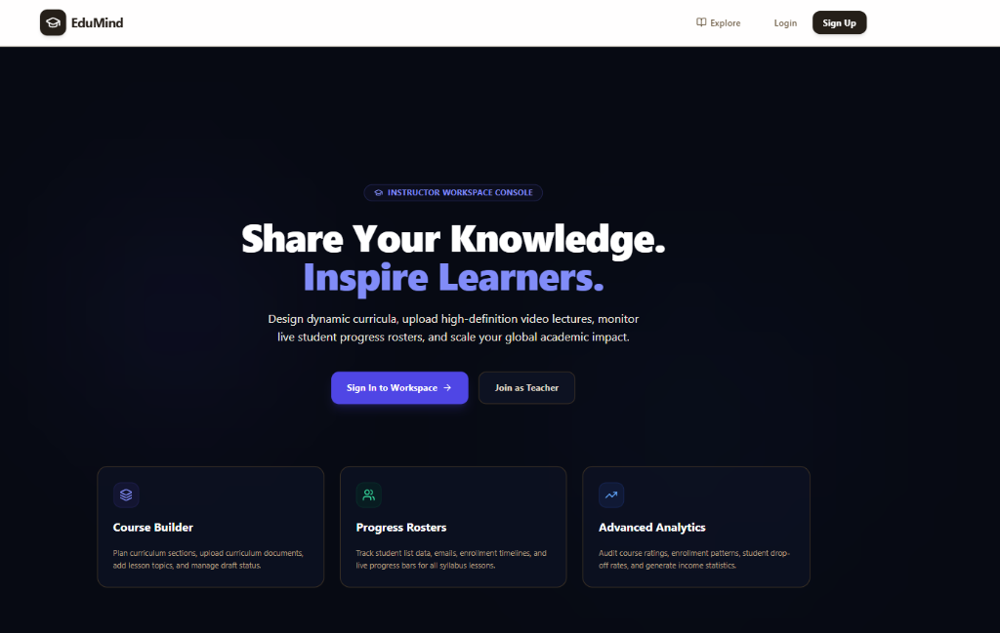

# 🎓 EduMind — Multi-Role EdTech Platform (Monorepo)

---

## 1. Introduction
EduMind is an industry-standard, portfolio-grade EdTech platform architected as a Node.js/React monorepo. It features strict role-based access control (RBAC) separating **Students**, **Teachers**, and **Administrators** into three specialized frontends sharing a unified backend database API.

---

## 2. Technology Stack & Tooling

<p align="left">
  
  
  
  
  
  
  
  
  
  
</p>

### Frontend (Apps)
* **React 19** & **Vite**: Ultra-fast build toolchain and rendering.
* **Tailwind CSS**: Utility-first styling for premium dark-themed layouts.
* **Lucide React**: Modern, scalable icon sets.
* **Axios**: Promised-based HTTP client with automatic base URL self-correction.

### Backend (Server)
* **Node.js** & **Express**: Highly modular REST API router.
* **Mongoose** & **MongoDB Atlas**: Document schema validation and cloud database storage.
* **JWT (JsonWebToken)**: Encrypted stateless user authentication.
* **Bcrypt.js**: Cryptographic password hashing.
* **Zod**: Runtime type checking and schema validation.
* **Multer** & **Cloudinary**: High-definition video and thumbnail upload handling.
* **Stripe**: Developer-ready payment processing flow.
* **Helmet** & **Express Rate Limit**: API protection and request limiting.

### Testing & Tooling
* **Vitest**: 23-test integration suite for authentication, courses, and middleware operations.
* **ESLint**: Standard JS clean code syntax checks.

---

## 3. Live Link

* **🎓 Student Learning Portal**: [https://ed-tech-platform-phi.vercel.app/](https://ed-tech-platform-phi.vercel.app/)
* **👨‍🏫 Instructor Workspace Console**: [https://ed-tech-platform-teacherapp.vercel.app/](https://ed-tech-platform-teacherapp.vercel.app/)
* **🛡️ Admin Command Center**: [https://ed-tech-platform-adminapp.vercel.app/](https://ed-tech-platform-adminapp.vercel.app/)
* **🌐 Shared Backend API Server**: [https://edtech-platform-qu5n.onrender.com](https://edtech-platform-qu5n.onrender.com)

---

## 4. Project Structure

The repository is structured as a clean monorepo:

```text
edtech-platform/
│
├── server/                    # Shared Node.js & Express REST API
│   ├── config/                # Third-party credentials (Cloudinary, etc.)
│   ├── middleware/            # Strict Auth Gates & RBAC checks
│   ├── models/                # MongoDB Schema (Users, Courses, Orders)
│   ├── routes/                # Endpoint controllers (auth, courses, upload, users)
│   └── tests/                 # 23-test Vitest integration suite
│
├── apps/                      # Specialized Role-Specific Frontend Portals
│   ├── student/               # Student Learning Portal (Port 5173)
│   ├── teacher/               # Teacher Workspace Console (Port 5174)
│   └── admin/                 # Admin Control Panel Dashboard (Port 5175)
│
├── packages/                  # Modular shared packages (placeholders)
│   ├── ui/
│   ├── api/
│   ├── auth/
│   └── utils/
│
└── assets/
    └── screenshots/           # Screenshot assets referenced in README
```

---

## 5. Key Production Features

### 🔐 Multi-App Role Isolation & Login Guards
* **Cross-App Defense**: Access is blocked if a Student tries to sign into the Admin workspace or vice versa. The login gates check role validation claims upon authentication.
* **Strict RBAC Middleware**: The API router uses strict parameter authorization checking (e.g. `restrictTo("Teacher", "Admin")` for moderator actions) without implicit admin bypasses.

### 🎓 Cryptographically Verifiable Credentials
* Graduates receive a unique certificate identifier and a cryptographic hash computed from their User ID, Course ID, and Completion Timestamp.
* Recruiters can visit the public `/verify-certificate/:certId` route on the Student app to verify the authenticity of credentials.

### 📊 Real-Time Student Rosters & Progress
* Instructors have a **Roster 👥** panel on each course card.
* Displays a live table of enrolled student emails, registration dates, and their exact completion progress (percentage with progress bar) based on lessons completed.

### 🛡️ Live Admin Analytics & SVG Charts
* Aggregates total learner registrations, instructors, courses, and syllabus lessons.
* Renders simulated monthly revenue metrics and server diagnostics (API latency, database uptime, memory load).
* Displays a beautiful, native SVG line chart showing user growth trends.

---

## 6. Environment Variables Configuration

Create a `.env` file inside the `server/` directory:

```env
# server/.env
PORT=5000
MONGO_URI=your_mongodb_connection_uri
JWT_SECRET=your_jwt_signing_secret

# Cloudinary Storage Configurations
CLOUD_NAME=your_cloudinary_cloud_name
CLOUD_API_KEY=your_cloudinary_api_key
CLOUD_API_SECRET=your_cloudinary_api_secret

# Payments Setup
STRIPE_SECRET_KEY=your_stripe_secret_key
```

Add this variable to your frontend applications during development or build:
```env
VITE_API_URL=https://edtech-platform-qu5n.onrender.com/api
```

---

## 7. Running the Applications Locally

You can launch all services simultaneously in separate terminals:

### 1. Start backend REST API
```bash
cd server
npm install
npm run dev
```

### 2. Start Student Portal
```bash
cd apps/student
npm install
npm run dev
```

### 3. Start Teacher Console
```bash
cd apps/teacher
npm install
npm run dev
```

### 4. Start Admin Dashboard
```bash
cd apps/admin
npm install
npm run dev
```

---

## 8. Screenshots

### 🛡️ Administrator Command Center
*Manage user roles, moderate catalog courses, inspect cryptographic certificate ledgers, and monitor live platform diagnostics.*


---

### 👨‍🏫 Instructor Workspace Console
*Design rich curricula, upload video lectures, manage draft/published courses, and view student progress rosters.*


---

### 🎓 Student Learning Portal
*Explore public course catalogs, view interactive video lessons, track completion progress, and share cryptographically verifiable certificates.*

